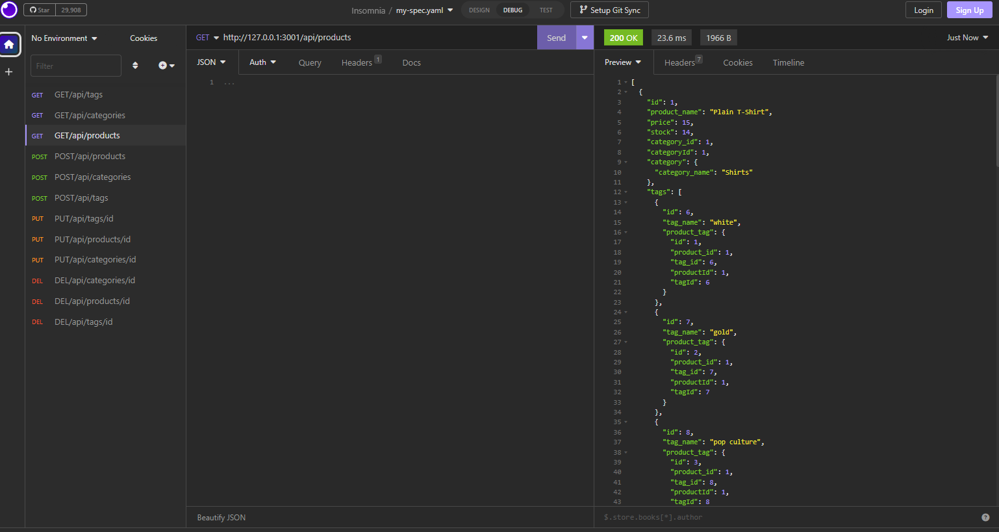
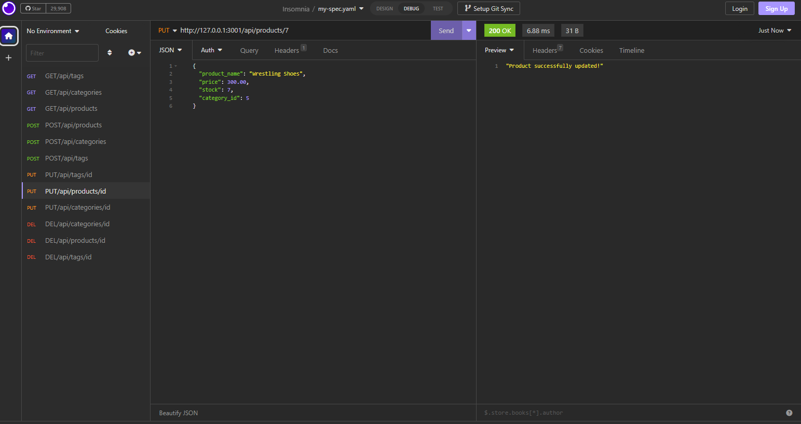
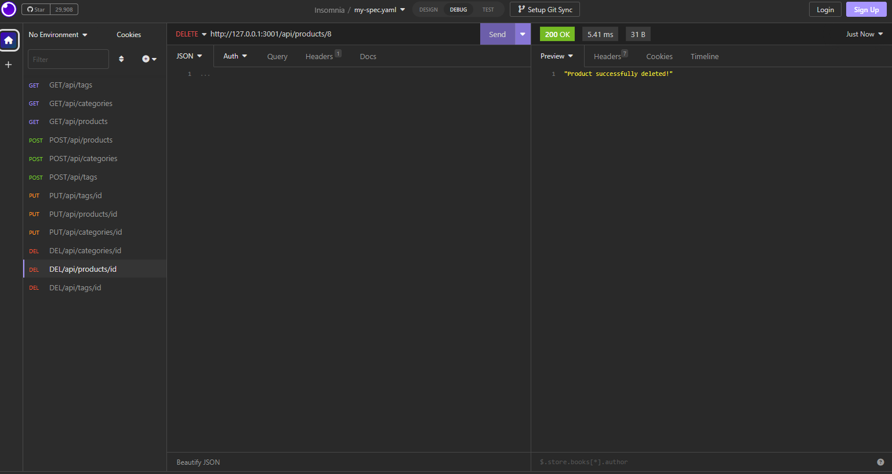

# E-Commerce-Database
  

## Description

This is a backend application for an e-commerce site. Given starter code to refactor I was able to write all the sequelize models and express.js routes to get the application functioning as it should. 

Tech used:

* dotenv
* Express.js
* MySQL2
* Sequelize

## Table of Contents
* [Installation](#installation)
* [Usage](#usage)
* [License](#license)
* [Display](#display)
* [Contributors](#contributors)
* [Tests](#tests)
* [Questions](#questions)

## Installation
npm i

## Usage
Visit the link below and to see a tutorial of how the backend works. You can get, create, update, and delete from the database. Who can do all four of these operations to products, categories, and tags.

https://drive.google.com/file/d/1pAUOwfHvyBrSAziQ-vbh2nzSLRVKPXF2/view?usp=sharing

## License
For more information on this license, please visit https://mit-license.org/

## Display

## Contributors
N/A

## Tests
N/A

## Questions
rdheadyii@gmail.com

https://github.com/rdheadyii
